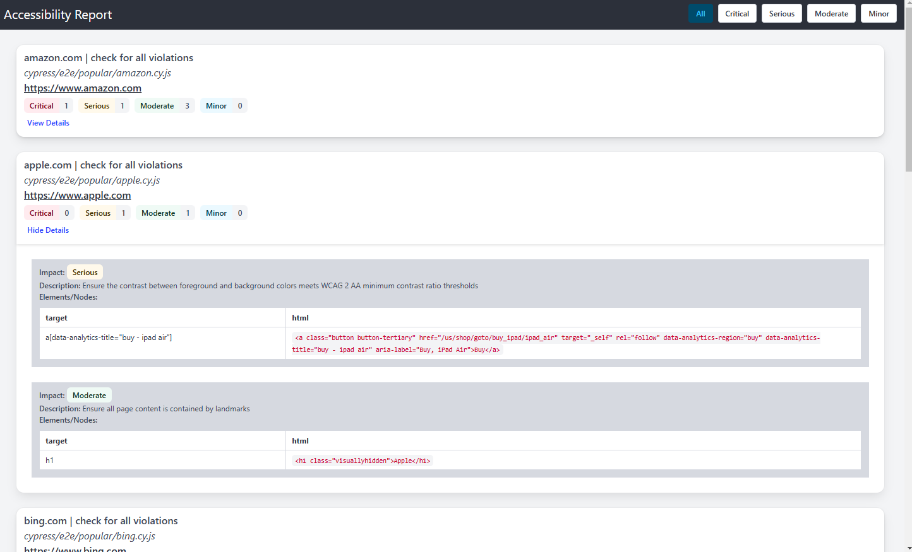

# cypress-axe-reporter

[](http://www.npmjs.com/package/cypress-axe-reporter)
[](https://github.com/psegurap/cypress-axe-reporter)


Simple reporter that integrates easily with [Cypress](https://github.com/cypress-io/cypress) and [Cypress-Axe](https://github.com/component-driven/cypress-axe) to output accessibility violations in a HTML format.

[Example report](https://psegurap.github.io/cypress-axe-reporter/docs/example-report.html)



## Setup

> This setup tutorial works with Cypress >= v10, and Cypress-Axe >= v1.5.0

1. install cypress-axe-reporter

   ```
   npm i --save-dev cypress-axe-reporter
   ```

   or

   ```
   yarn add -D cypress-axe-reporter
   ```

2. Change cypress reporter & setup hooks

   Edit config file (`cypress.config.js` by default)

   ```js
   const { defineConfig } = require('cypress');

   module.exports = defineConfig({
     e2e: {
       setupNodeEvents(on, config) {
         require('cypress-axe-reporter/plugin')(on);
       },
     },
   });
   ```

   If you are to override `before:run` or `after:run` hooks, use this:

   ```js
    const { defineConfig } = require("cypress");
    const { beforeRunHook, afterRunHook } = require("cypress-axe-reporter/lib");

    module.exports = defineConfig({
        e2e: {
            setupNodeEvents(on, config) {
                on("before:run", async (details) => {
                    await beforeRunHook(details);
                });

                on("after:run", async (results) => {
                    await afterRunHook(results);
                });
            },
        },
    });
   ```

3. Add to `cypress/support/e2e.js`

   ```js
   import 'cypress-axe-reporter/register'
   ```

4. Specify `cy.cypressAxeReporterCallBack` as the [violationCallback](https://github.com/component-driven/cypress-axe?tab=readme-ov-file#using-the-violationcallback-argument) argument

    ```js
    it("check for violations", () => {
        cy.checkA11y(null, null, cy.cypressAxeReporterCallBack);
    });
   ```

5. Run cypress
